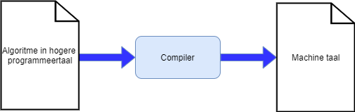

# The First Steps

Well, well, who do we have here?! Someone who wants to learn the noble art of programming? Then you've come to the right place. You may not believe it, but at the end of this chapter you will already be able to create your first very own computer applications. The road to eternal fame, glory, lots of cursing and reusing code is in front of you. Are you ready?

The first steps are never easy. We are gonna try to keep the amount of expensive words, weird abbreviations and complicated diagrams to a minimum. Still, if you want to learn a new art you will have to get your hands (and keyboard) dirty. No matter what happens in the coming chapters: keep persevering. Learning to program is a bit like learning to climb a mountain that you never seem to be able to reach the summit of. Which is also true. There is no "summit", and that is just the beauty of it all. There's always something new to learn! The things you will be cursing over in the coming pages will seem like child's play in a few chapters. So hang in there, keep practicing, feel free to curse every once in a while and most importantly: enjoy discovering new things!


## What is Programming?

You regularly hear the terms: software developer, programmer, app-developer, etc. All of these are proffesions that can essentially be reduced to the same thing: programming. Programmers have learned how to give computers commands (**programming**) so that they will hopefully do what you ask them to do.


In the 21st century the term *computer* is quite broad. Almost every device that runs on electricity now contains a computer. Ranging from smart lights, to the servers that keep the internet running, to the smartwatch on your wrist. Even quite a few refrigerators and washing machines are beginning to contain (small) computers.



The big problem with computers, regardless of their size or power, is that they are essentially incredibly stupid things. They will always do **exactly** what you tell them to do. So if you instruct them to explode, don't be shocked that you have to call 911 a moment later.

**Programming involves learning to talk to those dumb computers so they do what you want them to do.**

### The Algorithm

> First, solve the problem. Then, write the code.

This quote by John Johnson is sometimes frowned upon by many novice programmers. "I just want to write code!" It is a myth that programmers are constantly writing code. On the contrary, a good programmer will put much more time into the "preparation" for writing code: creating a good **algorithm**.

The algorithm is the essence of a computer program and can be thought of as the recipe that you are going to give to the computer so that it solves your problem correctly. The algorithm consists of a series of instructions that the computer must execute each time your program is executed.

The algorithm of a program is something you have to come up with yourself. However, the order in which the instructions are executed is very important. This is exactly the same as in real life: an algorithm to pump up your bicycle might be:

```text
Remove cap fom valve
Place pump on valve
Start pumping
```

Any other sequence of the above algorithm will give strange (and sometimes fatal) errors.

So if you want to learn programming, you will have to learn to think logically and have an analytical mind. If you kick a ball first before looking where the goal is then the noble art of programming will become a...special affair for you.


By the way, from now on you are authorized to email the news services every time they incorrectly use the word "logarithm" instead of "algorithm." The word logarithm is something that evokes nightmares from math classes for some and has absolutely nothing to do with programming. Of course, one day you may have to write an algorithm to calculate a logarithm. Hopefully, a journalist will never have to use the preceding sentence in a news report.


### Programming Language

To write an algorithm that our computer understands we need to use a programming language. Computers have their own language that programmers must know before they can *feed* their algorithm to the computer. There are numerous computer languages, some more obscure than others. But what all these languages have in common is that they usually:
* being **unambiguous**: every command or word can only be interpreted by the computer in exactly one way. This is in contrast to, say, English where "Jake told Tom he had  a problem." could both mean that Jake or Tom has a problem.
* consist of **vocabulary**: just like English, every programming language has a, usually limited, list of words you can use. You don't make up words in English in the hope that your partner can understand you. To make this comparison work, we'll ignore Shakespear for a moment.
* consist of **grammar rules**: Only Yoda may use English in a wrong order. Everyone else is best to adhere to the grammar rules that a language has. "Ball red is" still seems understandable, but if we say "ball red boy is throws a lot"?

### The C# Language

Just as there are countless spoken languages in the world, there are also many programming languages. **C#** (pronounced *'c-sharp'*) is one of many. C# is a language that is part of the .NET (pronounced *'dotnet'*) environment developed by Microsoft 20 years ago (July 2000). The nice thing about C# is that it is a so-called **higher programming language**. The "higher" the programming language, the more readable it becomes for laymen because higher programming languages are closer to our own. 

Telling the history of the entire .NET world would be a book in itself and we're not going to do it here. It is useful to know that there is a gigantic source of information about .NET and C# online, starting with [docs.microsoft.com](https://docs.microsoft.com/en-us/dotnet/csharp/getting-started/).


The nice thing about learning to program is that you are soon going to get to a certain point where the choice of programming language matters less. Compare it to learning French. Once you have mastered French, it is much easier to then learn Italian or Spanish. It's the same with programming languages. For example, the C# language is incredibly similair to Java, as well as to the languages it descends from, C and C++. 

Even JavaScript, Python, and many other modern languages will hold few secrets for you when you get to the end of this book.


### The Compiler

Directly telling our algorithms to the computer requires us to be able to speak machine language. However, this is so complex that we need dozens of lines of machine language just to get 1 letter on the screen. So higher programming languages were developed that are more pleasant than these so-called machine languages for talking to computers.

Of course, we need a translator that will translate our code into the machine language of the device on which our program must run. This translator is the **compiler** which takes on quite a bit of complex work, but thus essentially makes our code ready for use by the computer.



Note that we are leaving out many details of the compiler here. The compiler is an extremely complex element, but at this stage of your (fledgling) programmer's life, we only need to understand the core of the compiler: **converting C# code to an executable file written in IL code**.


**Microsoft .NET**

The birth of .NET in 2000 included the language C#.

.NET is a so-called **framework**. This framework consists of a large group of libraries (*class libraries*) and a *virtual execution system* called the **Common Language Runtime (CLR)**. The CLR will allow C#, or other .NET languages (F#, VB.NET, etc.), to interoperate with the many libraries.

To create an executable file (**executable**, hence the extension .exe for executable programs in windows), the source code you wrote in C# will be converted to **Intermediate Language** (IL) code. By itself, this IL code is not yet executable, but that is not our problem. When a user wants to execute a file written in IL then, behind the scenes, the CLR will immediately convert this code to machine code (**Just-In-Time** or JIT compilation) and execute it. Thus, the user will never notice this process (unless there is no .NET framework installed on the system).

