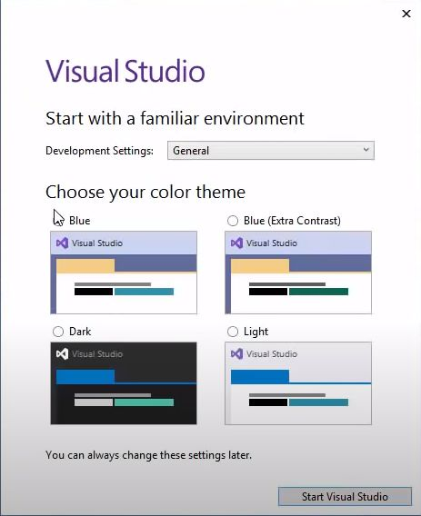
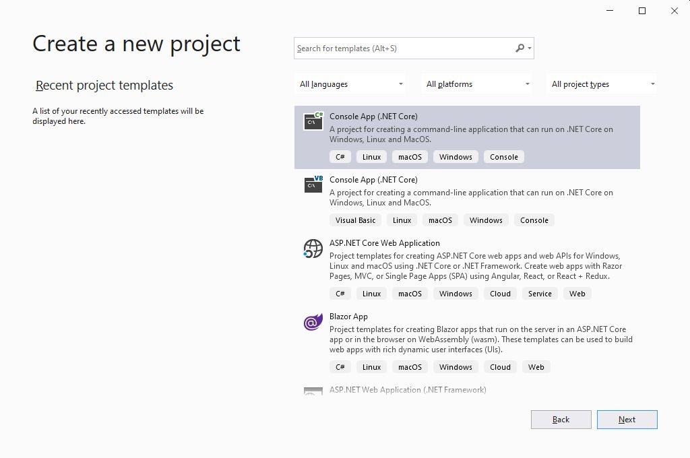
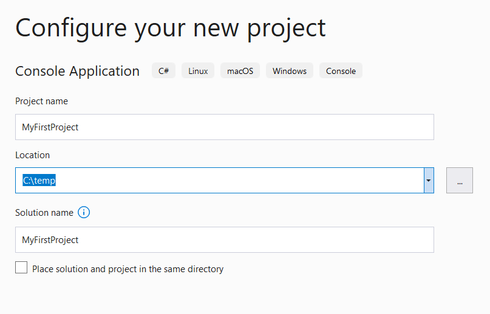
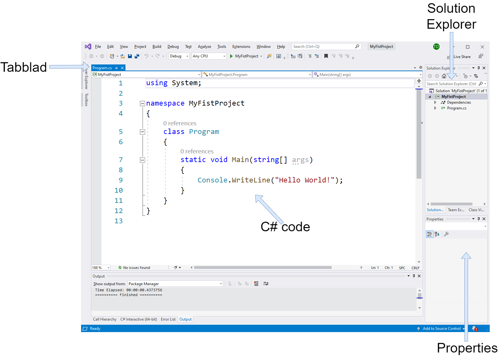

## Kennismaken met C# en Visual Studio

We gaan in dit boek leren programmeren met Microsoft Visual Studio, een softwarepakket waar ook een gratis community versie voor bestaat.Microsoft Visual Studio (vanaf nu **VS**) is een pakket dat een groot deel van de tools samenvoegt die een programmeur nodig heeft (debugger, code editor, compiler, etc).

<!--- {height:10%} --->

VS is een zogenaamde IDE ("Integrated Development Environment") en is op maat gemaakt om in C# geschreven applicaties te ontwikkelen. Je bent echter verre van verplicht om enkel C# applicaties in VS te ontwikkelen, je kan gerust VB.NET, TypeScript, Python en andere talen gebruiken. Ook vice versa ben je niet verplicht om VS te gebruiken om te ontwikkelen. Je kan zelfs in notepad code schrijven en vervolgens compileren (zie hierna). Er bestaan zelfs online C# programmeer omgevingen, zoals [dotnetfiddle.net](https://dotnetfiddle.net/).

 
In dit boek zullen we steeds werken met Visual Studio. Niet met Visual Studio Code. Visual Studio code is een zogenaamde lightweight versie van VS die echter zeker ook z'n voordelen heeft (makkelijk uitbreidbaar, snel, compact, etc). Visual Studio vindt dankzij VS Code eindelijk ook z'n weg op andere platformen dan enkel die van Microsoft. Zoek je een lightweight versie dan moet je zeker eens [Visual Studio Code](https://code.visualstudio.com/) eens proberen.


### De compiler en Visual Studio

Zoals gezegd: jouw taak als programmeur is algoritmes in C# taal uitschrijven. We zouden dit in een eenvoudige tekstverwerker kunnen doen, maar dan maken we het onszelf lastig. Net zoals je tekst in notepad kunt schrijven, is het handiger dit in bijvoorbeeld Word te doen: je krijgt een spellingchecker en allerlei handige extra's. 

Ook voor het schrijven van computer code is het handiger om een zogenaamde IDE te gebruiken, een omgeving die ons zal helpen foutloze C# code te schrijven.

Het hart van Visual Studio bestaat uit de compiler die we hiervoor besproken. De compiler zal je C# code omzetten naar de IL-code zodat jij (of anderen) je applicatie op een computer (of ander apparaat) kunnen gebruiken. Zolang de C# niet exact voldoet aan de C# syntax en grammatica zal de compiler het vertikken een uitvoerbaar bestand voor je te genereren. 

### Visual Studio Installeren

In dit boek zullen de voorbeelden steeds met de **Community** editie van VS gemaakt zijn. Je kan deze gratis downloaden en installeren  via [visualstudio.microsoft.com/vs](https://visualstudio.microsoft.com/vs/).

Het is belangrijk bij de installatie dat je minimaal volgende zaken selecteert:
* de **.NET desktop development** en **.NET Core cross-platform development**  workload. 
* bij individual components de "**Class Designer**" aanduiden

Uiteraard ben je vrij om meerdere zaken te installeren.

### Visual studio opstarten

Als alles goed is geïnstalleerd kan je Visual Studio starten zoals je gewend bent in je operating system. 

#### Allereerste keer opstarten
De allereerste keer dat je VS opstart krijg je 2 extra schermen te zien:
* Het "sign in" scherm mag je overslaan (kies "Not now, maybe later")
* Vervolgens kan je je kleurenthema kiezen. Dit heeft geen invloed op de manier van werken.  

<!--- {height:30%} --->

#### Project keuze
Na het opstarten van VS krijg je het startvenster te zien van waaruit je verschillende dingen kan doen. Van zodra je projecten gaan aanmaken zullen deze in de toekomst ook op dit scherm getoond worden zodat je snel naar een voorgaand project kunt gaan. 

<!--- {height=30%} --->

#### Een nieuw project aanmaken

We zullen nu een nieuw project aanmaken, kies hiervoor "Create a new project".

<!--- {height=30%} --->


Het "New Project" venster dat nu verschijnt geeft je hopelijk al een glimp van de veelzijdigheid van VS. In het rechterdeel zie je bijvoorbeeld alle Project Types staan. M.a.w. dit zijn alle soorten programma’s die je kan maken in VS. Naargelang de geïnstalleerde opties en bibliotheken zal deze lijst groter of kleiner zijn.


In dit boek zullen we altijd het  Project Type  **Console App (.NET Core)** gebruiken. Een console applicatie is een programma dat alle uitvoer naar een zogenaamde ‘console’ stuurt, een shell. M.a.w., je kan enkel tekst (Unicode) als uitvoer genereren en dus geen multimedia elementen zoals afbeeldingen, geluid, etc.

Kies dit type en klik 'Next'.

Op het volgende scherm kan je een naam ingeven voor je project alsook de locatie op de harde schijf waar het project dient opgeslagen te worden. **Onthoudt waar je je project aanmaakt zodat je dit later terugvindt**.


**De solution name blijf je af (deze moet momenteel dezelfde naam zijn als je project).**



Geef je projectnamen ogenblikkelijk duidelijke namen zodat je niet opgezadeld geraakt met projecten zoals Project201, etc. waarvan je niet meer weet welke belangrijk zijn en welke niet.

Geef je project de naam "MyFirstProject" en kies een goede locatie (ik raad je aan dit steeds in Dropbox of Onedrive te doen).

**Klik nu op create**.

VS heeft nu reeds een aantal bestanden aangemaakt die je nodig hebt om een ‘Console Applicatie’ te maken. 

### IDE Layout

Wanneer je VS opstart zal je mogelijk overweldigd worden door de hoeveelheid menu's, knopjes, schermen, etc. Dit is normaal voor een IDE: deze wil zoveel mogelijk mogelijkheden aanbieden aan de gebruiker. Vergelijk dit met Word: afhankelijk van wat je gaat doen gebruikt iedere gebruiker andere zaken van Word. De makers van Word kunnen dus niet bepaalde zaken weglaten, ze moeten net zoveel mogelijk aanbieden.


Laat je niet afschrikken door VS. Het is een imponerend programma, maar je zal er sneller dan je verwacht je weg in terugvinden!


We zullen nu eerst eens bekijken wat we allemaal zien in VS na het aanmaken van een nieuw programma.

* Je kan meerdere bestanden tegelijkertijd openen in VS. Ieder bestand zal z'n eigen **tab** krijgen. De actieve tab is het bestand wiens inhoud je in het hoofdgedeelte eronder te zien krijgt. Merk op dat enkel open bestanden een tab krijgen. Je kan deze tabbladen ook "lostrekken" om bijvoorbeeld enkel dat tabblad op een ander scherm te plaatsen.

* De "**solution explorer**" toont alle bestanden en elementen die tot het huidige project behoren. Als we dus later nieuwe bestanden toevoegen dan kan je die hier zien (en openen). Verwijder hier géén bestanden zonder dat je zeker weet wat je aan het doen bent.

* Het **properties** venster (eigenschappen) is een belangrijk venster. Hier komen alle eigenschappen van het huidige geselecteerde element. Selecteer bijvoorbeeld maar eens Program.cs in de solution explorer en merk op dat er allerlei eigenschappen getoond worden. Onderaan het Properties venster wordt steeds meer informatie getoond over de huidig geselecteerde eigenschap.



**Layout kapot/kwijt/vreemd**

De layout van VS kan je volledig naar je hand zetten. Je kan ieder (deel-)venster en tab verzetten, verankeren en zelfs verplaatsen naar een ander bureaublad. Experimenteer hier gerust mee en besef dat je steeds alles kan herstellen. Het gebeurt namelijk al eens dat je layout een beetje om zeep is:

* Om eenvoudig een venster terug te krijgen, bijvoorbeeld het properties window of de solution explorer: klik bovenaan in de menubalk op "View" en kies dan het gewenste venster (soms staat dit in een submenu).
* Je kan ook altijd je layout in z'n geheel **resetten**: ga naar "Window" en kies "Reset window layout".

<!--- {width:40%} --->



### Je programma starten

De code die VS voor je heeft gemaakt is reeds een werkend, maar weinig nuttig, programma. Je kan de code compileren en uitvoeren door op de groene driehoek bovenaan te klikken:

Als alles goed gaat krijg je nu "Hello world" te zien en wat extra informatie omtrent het programma dat net werd uitgevoerd:

Veel doet je programma nog niet natuurlijk, dus sluit dit venster maar terug af door een willekeurige toets in te drukken.

### Is dit alles?

Nee hoor. Visual Studio is lekker groot. Was bovenstaande uitleg toch niet zo verhelderend als ik hoopte? Bekijk dan volgende korte, maar zeer duidelijke uitleg over Visual Studio en de verschillende onderdelen (klik zeker op de chapters in het linkermenu om verder te lezen [https://tutorials.visualstudio.com/vs-get-started/intro](https://tutorials.visualstudio.com/vs-get-started/intro)).

<!---NOBOOKSTART--->

### Kennisclip

* [De VS omgeving](https://ap.cloud.panopto.eu/Panopto/Pages/Viewer.aspx?id=7f6e9867-6b45-4c98-9255-aacd00880111)
* [De folderstructuur van projecten](https://ap.cloud.panopto.eu/Panopto/Pages/Viewer.aspx?id=f021b918-db11-43e4-93bf-a969006a6868)

<!---NOBOOKEND--->
