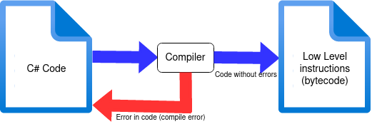

## Introduction to C# and Visual Studio

In this book we are going to learn how to program with Microsoft Visual Studio 2019, a software package for which there is also a free community version. Microsoft Visual Studio (from now on **VS**) is a package that brings together many of the tools a programmer needs (debugger, code editor, compiler, etc).

VS is a so-called IDE ("Integrated Development Environment") and is tailored to develop applications written in C#. However, you are far from required to develop only C# applications in VS, you can feel free to use VB.NET, TypeScript, Python and other languages. Also vice versa, you are not required to use VS to develop. You can even write code in notepad and then compile it (see below). There are even online C# programming environments, such as [dotnetfiddle.net](https://dotnetfiddle.net/).


In this book, we will always work with Visual Studio. Not with Visual Studio Code. Visual Studio Code is a lightweight version of VS that certainly has its advantages (easily extensible, fast, compact, etc). Thanks to VS Code, Visual Studio is finally finding its way onto other platforms than just Microsoft. If you are looking for a lightweight version then you should definitely try [Visual Studio Code](https://code.visualstudio.com/).


### The Compiler and Visual Studio

As mentioned, your job as a programmer is to write out algorithms in C# language. We could do this in a simple text editor, but then we make it hard on ourselves. Just like you can write text in notepad, it is more convenient to do this in, say, Word: you get a spell checker and all sorts of useful extras.

For writing computer code it is also more convenient to use a so-called IDE, an environment that will help us write error-free C# code.

The heart of Visual Studio consists of the compiler we discussed above. The compiler will convert your C# code to the IL code so that you (or others) can use your application on a computer (or other device). As long as the C# does not conform exactly to the C# syntax and grammar, the compiler will refuse to generate an executable file for you.

