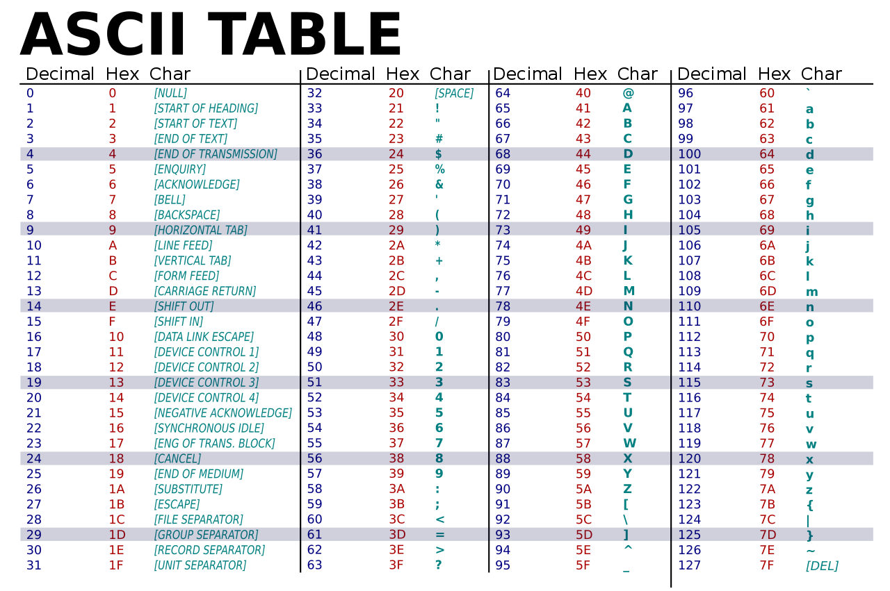

# Tekst gebruiken in code

## Tekst datatypes

In het vorige hoofdstuk werkten we vooral met getallen en haalden we maar kort het ``string`` en ``char`` datatype aan. In dit hoofdstuk gaan we dieper in deze 2 veelgebruikte datatypes in.

### Char

Een **enkel karakter** (cijfer, letter, leesteken, etc.) als 'tekst' opslaan kan je doen door het `char`-type te gebruiken. Zo kan je bijvoorbeeld een enkel karakter als volgt tonen:

```csharp
char eenLetter = 'X';
Console.WriteLine("eenLetter=" + eenLetter);
```

Het is belangrijk dat je de apostrof (``'``) niet vergeet voor en na het karakter dat je wenst op te slaan daar dit de literal voorstelling van `char`-literals is.

Je kan eender welk [UNICODE-teken](https://en.wikipedia.org/wiki/Unicode) in een `char` bewaren, namelijk letters, cijfers en speciale tekens zoals `%`, `$`, `*`, `#`, etc.

Merk dus op dat volgende lijn: ``char eenGetal = '7';`` weliswaar een getal als teken opslaat, maar dat intern de compiler deze variabele steeds als een character zal gebruiken. Als je dit cijfer zou willen gebruiken als effectief cijfer om wiskundige bewerkingen op uit te voeren, dan zal je dit eerst moeten converteren naar een getal.



Ieder teken dat je op je toetsenbord kunt intypen is dus een ``char``. Je toetsenbord bevat echter maar een kleine selectie van alle mogelijkheden (vergelijk jouw toetsenbord bijvoorbeeld maar eens met dat van iemand in Rusland).

Voor de statistieknerds onder ons: er zijn 1,111,998 unicode karakters mogelijk. Momenteel zijn er daarvan 137,929 gedefiniëerd. We hebben dus nog wel wat plek.

Unicode is een standaard die de zogenaamde Ascii-standaard opvolgt omdat die te klein (qua aantal bits) bleek te zijn om naar de toekomst toe de ontelbare nieuwe tekens in voor te stellen. De Ascii standaard kan 128 karakters voorstellen (mbv 7 bit), wat uiteraard in het niets valt in vergelijking met de meer dan 1 miljoen teken in Unicode. Uiteraard heeft de Unicode-standaard die eerste 128 van Ascii als eerste gezet en zijn beide tabellen dus 'compatibel'  (Unicode is een superset van Ascii). 



De eerste 1F karaters zijn "onzichtbare" karakters die een historische reden hebben om in de lijst te staan, maar sommige ervan zijn ondertussen niet meer erg nuttig. Origineel werd Ascii ontwikkeld als standaard om via de telegraaf te combineren. Vandaar dat vele van deze karakters commando's lijken om oude typemachines aan te sturen (line feed, bell, form feed, etc) want dat zijn ze dus ook effectief!


### String
Een string is een reeks (eigenlijk [array](../7_arrays/1_ArraysBasics.md)) van 0, 1 of meerdere `char`-elementen, zoals je ook kan zien als je even met je muis boven een string keyword *hovert* in je code:


#### Strings declareren
Merk op dat we bij een string literal gebruik maken van aanhalingstekens (`"`) terwijl bij chars we een apostrof gebruiken (`'`). Dit is de manier om een string van een char te onderscheiden.

Volgende code geeft dus drie keer het cijfer 1 onder elkaar op het scherm, maar de eerste keer gaat het om het een ``char`` (enkelvoudig teken), dan een een ``string`` (reeks van tekens) en dan een ``int`` (effectief getal):

```csharp
char eenKarakter = '1'; 
string eenString = "1"; 
int eenGetal = 1;
 
Console.WriteLine(eenKarakter);
Console.WriteLine(eenString);
Console.WriteLine(eenGetal);
```
De output van dit programma zal dan zijn:

<!---{line-numbers:false}--->
```text
1
1
1
```

Fout gebruik van strings en chars zal code geven die niet zal gecompileerd worden:

```csharp
char eenKarakter = "1"; //fout
string eenString = '1'; //fout
int eenGetal = '1'; //fout
```

1. In de eerste toekenning proberen we dus een literal van het type **string** toe te kennen een variabele van het type **char**.
2. In de tweede toekenning proberen we een literal van het type **char** toe te kennen een variabele van het type **string**.
3. In de laatste toekenning proberen we een literal van het type **char** toe te kennen aan een variabele van het type **int**.