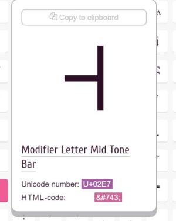

## Vreemde tekens in console tonen

Niets is zo leuk als de vreemdste Unicode tekens op het scherm tonen. In oude console-games werden deze tekens vaak gebruikt om complexe tekeningen op het scherm te tonen. Om je ietwat saaie applicaties dus wat toffer te maken leggen we daarom uit hoe je dit kan doen.

<!---{width:70%} --->


### Unicode karakters tonen

Je toetsenbord heeft maar een beperkt aantal toetsen. Er zijn echter tal van andere tekens gedefinieerd die console-applicaties ook kunnen gebruiken. We zagen reeds dat al deze tekens, Unicode-karakters, een eigen unieke code hebben die je kan opzoeken om vervolgens dat teken in je code te gebruiken, daar het ``char`` type hiermee werkt.

Dit gaat als volgt in z'n werk:

1. Zoek het teken\(s\) dat je nodig hebt in een Unicode-tabel \([deze is handig](https://Unicode-table.com/en/)\)
2. Plaats bovenaan je Main: `Console.OutputEncoding = System.Text.Encoding.UTF8;`
3. Je kan nu op 2 manieren dit teken in console plaatsen.

<!---{pagebreak} --->

Stel je voor dat we volgende "omgekeerde t" wensen te gebruiken in onze applicatie:
<!---{height:30%} --->


#### Manier 1: copy/paste

Kopieer het karakter zelf en plaats het in je code waar je het nodig hebt, bijvoorbeeld:

```java
Console.WriteLine("˧"); //eigenlijk staat hier die omgekeerde t
```

Helaas zal dit teken als een vierkantje in de meeste boeken getoond worden omdat het lettertype dit teken niet kent. Je zal hetzelfde fenomeen trouwens in je console hebben bij tekens die het Console-lettertype (meestal Courier) niet kent.

#### Manier 2: hexadecimale code casten naar char

Noteer de hexadecimale code van het karakter dat in de tabel staat. In dit geval is de code 0x02e7. Om dit teken te tonen schrijf je dan:

```java
char blokje = (char)0x02e7;
Console.WriteLine(blokje);
```

In C# schrijf je hexadecimale getallen als volgt als je ze rechtsreeks in een string wilt plaatsen: \u02e7

Wil je dus bovenstaande teken schrijven dan kan dat ook als volgt:

```java
Console.WriteLine("\u02e7");
```

### Unicode-art tonen

Soms zou je multiline Unicode-art (ook wel Ascii-art genoemd) willen tonen in je C# applicatie. Dit kan je eenvoudig oplossen door gebruik te maken van het ``@`` teken voor een string.

Stel dat je een toffe titel of tekening bijvoorbeeld via [Asciiflow](http://asciiflow.com/) maakt.

Je kan het resultaat eenvoudig naar je klembord kopiëren en vervolgens in je C#-code integraal copy pasten als literal voor een ``string`` op voorwaarde dat je het laat voorafgaan door ``@"`` en uiteraard eindigt met ``";``.

Bijvoorbeeld:

```java
string myname=@"
___________________   
\__    ___/\______ \  
  |    |    |    |  \ 
  |    |    |    `   \
  |____|   /_______  /
                   \/ ";

Console.WriteLine(myname);
```


Zowel de $-notatie (voor string interpolatie) als het  @-teken kan je gecombineerd gebruiken bij een string:

```java
Console.WriteLine($@"1/1={1+1}. \tGeen tab");
```

Dit geeft als output (``\t`` wordt door het apenstaartje genegeerd):

<!---{line-numbers:false}--->
```text
1/1=2. \tGeen tab
```


<!---NOBOOKSTART--->
### Kennisclip


* [Unicode tonen](https://ap.cloud.panopto.eu/Panopto/Pages/Viewer.aspx?id=9b7eb60b-35fd-4f4e-b825-ac3800850087)
<!---NOBOOKEND--->