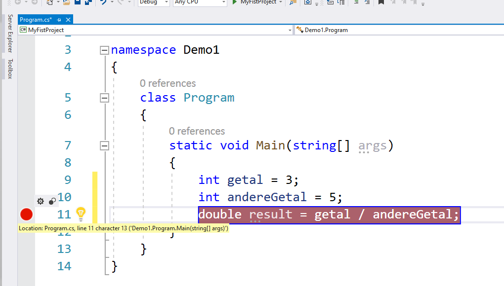
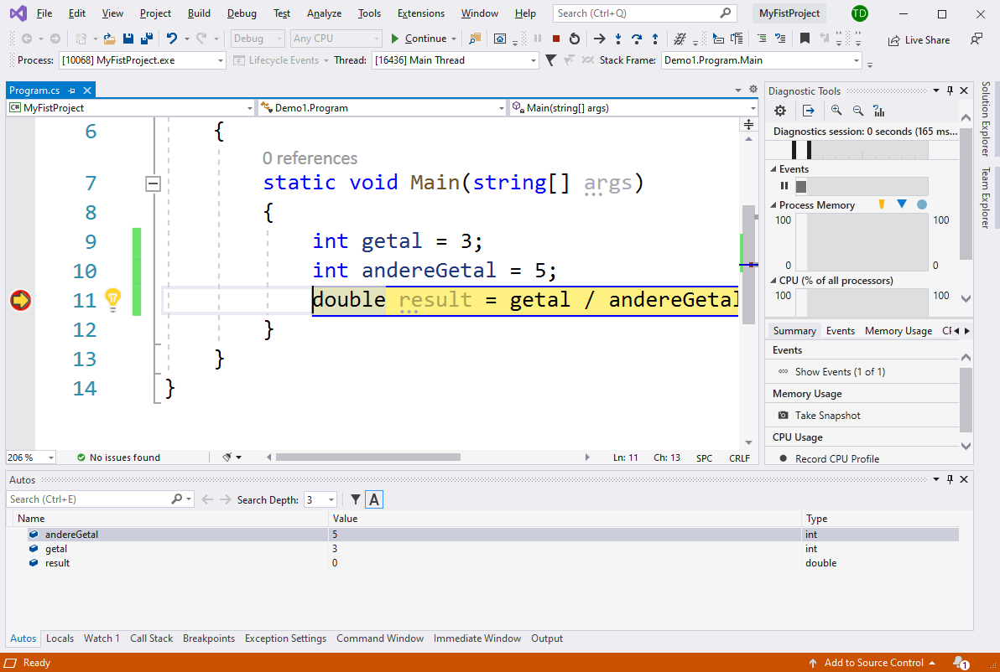

## Debuggen

Joepie!! M'n code werkt! Je ontkurkt de champagne, doet een vreugdedansje en laat je programma door duizenden gebruikers ontdekken. Enkele seconden later staat er een meute met hooivorken en toortsen voor je kantoor. Helaas! Er zaten nog 'enkele bugs' in je code. 
Tijd dus om je **debugger** boven te halen en die (logische) fouten uit je code te halen.

### Debuggen is veel werk

Code die compileert is enkel code die foutloos geschreven is volgens de C# afspraken qua grammatica en syntax. De code zal met andere woorden gecompileerd worden, maar wat er daarna gebeurt is volledig afhankelijk van wat juist de betekenis is van wat je hebt geschreven.


Volgende "code" is perfecte Nederlandstalige code. Het uitvoeren is echter niet aan te raden:
<!---{line-numbers:false}--->
```text
Neem natrium
Neem water
Voeg beide samen
```

Dit is dus een logische fout, oftewel bug.


### Debuggen met Visual Studio

Standaard wanneer je je code uitvoert met de grote groene playknop start jouw programma in zogenaamde "debug modus". Dit laat je toe om je code ten allen tijde te onderbreken en naar de huidige staat van je programma te kijken.

Om dit te doen moet je een **breakpoint** (of meerdere) in je code plaatsen. Breakpoint zet je aan een lijn code en wanneer je programma dan aan deze lijn komt zal de debugger alles pauzeren.

Een breakpoint plaats je door op het grijze gedeelte links van de lijn code te klikken. Als alles goed gaat verschijnt er dan een grote rode "breakpointbol".
<!--- {height:30%} --->


Als je nu je project uitvoert zal de code pauzeren aan die lijn en zal VS in "debug modus" openspringen:


In dit "nieuwe" scherm zijn er momenteel 2 belangrijke delen:
* Onderaan zie je de **autos** en **locals** . In deze tabs kan je de waarden van iedere variabele in je huidige code zien op het moment van pauzeren. Ideaal om te onderzoeken waarom een bepaalde berekening of expressie niet doet wat ze moet doen
* Bovenaan zijn enkele debug-knoppen verschenen. Deze lichten we in de volgende sectie toe


Wanneer je gepauzeerd bent in debug-modus kan je met je muis over eender welke variabele of expressie *hoveren* om het resultaat van dat element te bekijken.

Kan je verklaren waarom deze deling 0 zal geven?!



### Door je code steppen

Wanneer je gepauzeerd bent kan je de nieuw verschenen debug-knoppen boven gebruiken om het verdere verloop te bepalen:


We lichten hier de knoppen toe die je zeker zal nodig hebben:
* De **continue** knop is logisch: hier op klikken zal je programma terug voortzetten vanaf het breakpoint waar je gepauzeerd bent. Het zal vervolgens verder gaan tot het weer een breakpoint bereikt of wanneer het einde van het programma wordt bereikt.
* De **rode stop** knop gebruik je indien je niet verder wilt debuggen en ogenblikkelijk terug je code wilt aanpassen.
* De **step-over** knop (het gebogen pijltje) is een belangrijke knop. Deze zal je code & lijn code verder uitvoeren en dan weer pauzeren. Het laat je dus toe om letterlijk doorheen je code te *stappen*. Je kan dit doen om de flow van je programma te bekijken (zie volgende hoofdstukken) en om te zien hoe bepaalde variabelen evolueren doorheen je code. 

<!--- {height:50%} --->



Voorman Tim hier. Even je oren open zetten aub, ik ga iets roepen:**"Debugging is een ESSENTIËLE SKILL!!!"**. Ik laat mijn metselaars ook geen huizen bouwen zonder dat ze ooit een truweel hebben vastgepakt. Een programmeur die niet kan debuggen...is als een vis die niet kan zwemmen!. 
 
 Zorg dus dat je vlot breakpoints kunt plaatsen om zo tijdens de uitvoer te pauzeren om de inhoud van je variabelen te bekijken (via het zogenaamde watch-venster). Gebruik vervolgens de "step"-buttons om door je code te 'stappen', lijn per lijn.

Neem volgende korte demonstratie van debugging door: [Debugging in Visual Studio](https://tutorials.visualstudio.com/vs-get-started/debugging).




Over de oorsprong van het woord *bug* en de term *debugging* is er wat onzekerheid. Maar (Wikipedia)[https://en.wikipedia.org/wiki/Debugging] weet dit te vertellen:

> "The terms "bug" and "debugging" are popularly attributed to Admiral Grace Hopper in the 1940s. While she was working on a Mark II computer at Harvard University, her associates discovered a moth stuck in a relay and thereby impeding operation, whereupon she remarked that they were "debugging" the system. However, the term "bug", in the sense of "technical error", dates back at least to 1878 and Thomas Edison."



### Kennisclip

* [Debuggen in VS ](https://ap.cloud.panopto.eu/Panopto/Pages/Viewer.aspx?id=a78b3bf5-ef96-4c2a-8248-a976006fabd1)

