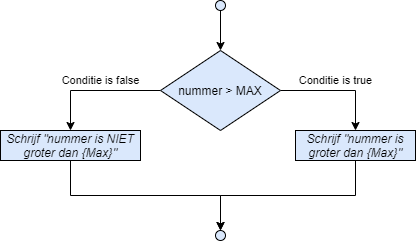

## If

De ``if`` uitdrukking is één van de meest elementaire uitdrukking in een programmeertaal en laat ons toe 'vertakingen' in onze programmaflow in te bouwen.

De syntax is als volgt:

```csharp
if (booleaanse expressie) 
{
     //indien de booleaanse expressie waar is
}

```
Enkel indien de booleaanse expressie waar is, en dus ``true`` als resultaat heeft, zal de code binnen de accolades van het if-blok uitgevoerd worden. Indien de expressie niet waar is (``false``) dan wordt het blok overgeslagen en gaat het programma verder met de code eronder.

Een voorbeeld:
```csharp
int number = 3;
if ( number < 5 )
{
    Console.WriteLine ("A");
}
Console.WriteLine("B");
```

De uitvoer van dit programma zal zijn:

```text
A
B
```

Indien ``number`` groter of gelijk aan 5 was dan zou er enkel ``B`` op het scherm zijn verschenen. De lijn ``Console.WriteLine("B")`` zal sowieso uitgevoerd worden zoals je ook kan zien aan de volgende flowchart:



### if met een block

Het is aangeraden om steeds na de if-expressie met accolades te werken. Dit zorgt ervoor dat alle code tussen het block (de accolades) zal uitgevoerd worden indien de booleanse expressie waar was. **Gebruik je geen accolades dan zal enkel de eerste lijn na de ``if`` uitgevoerd worden bij ``true``.**

Een voorbeeld:
```csharp
if ( number < 5 )
{
    Console.WriteLine ("C");
    Console.WriteLine ("D");
}
```


De booleaanse expressie die je tussen de ``if`` haakjes plaats moet een stuk code zijn dat altijd een ``bool`` als resultaat teruggeeft. 





**Veelgemaakte fouten**
Voorman Tim hier! Je hebt me gemist. Ik merk het. Het ging goed de laatste tijd. Maar nu wordt het tijd dat ik je weer even wakker schudt want de code die je nu gaat bouwen kan érg vreemde gedragingen krijgen als je niet goed oplet. Luister daarom even naar deze lijst van veel gemaakte fouten wanneer je met ``if`` begint te werken: 
Er zijn enkele veelgemaakte fouten waar je op moet letten:

**Appelen en peren vergelijken**
De types in je booleaanse expressie moeten steeds vergelijkbaar zijn. Volgende code is dus fout: ``if( "4" > 3)`` daar we hier een ``string`` met een ``int`` vergelijken.

**Accolades vergeten**
Accolades vergeten plaatsen om een codeblock aan te duiden, maar je code toch zodanig uitlijnen (met tabs of spaties) dat het lijkt of je een heel codeblock hebt. Het gevolg zal zijn dat enkel de eerste lijn na de ``if`` zal uitgevoerd worden indien ``true``. Gebruiken we de ``if`` met block van daarnet maar zonder accolades dan zal de laatste lijn altijd uitgevoerd worden ongeacht de ``if``:

```csharp
if ( number < 5 )
    Console.WriteLine ("C");
    Console.WriteLine ("D");
```


Merk ook op dat je code anders uitlijnen géén invloed heeft op de uitvoer (wat bijvoorbeeld wel zo is bij de programmeertaal Python).

**Een puntkomma plaatsen na de booleanse expressie.** 

Dit zal ervoor zorgen dat er eigenlijk geen codeblock bij de ``if`` hoort en je dus een nietszeggende ``if`` hebt geschreven. De code na het puntkomma zal uitgevoerd worden ongeacht de ``if``:

```csharp
if ( number < 5 );
    Console.WriteLine ("C");
    Console.WriteLine ("D");
```




### Gebruik relationele en logische operatoren

We kunnen ook meerdere booleanse expressie combineren zodat we complexere uitdrukkingen kunnen maken. Hierbij kan je gebruik maken van de logische operatoren (``&&``, ``||``, ``!``) .

Een voorbeeld:
```csharp
int a = 5, b = 5, c = 10;
 
if (a == b)
{
        Console.WriteLine(a);
}
 
if ((a > c) || (a == b))
{  
    Console.WriteLine(b);
}
 
if ((a >= c) && (b <= c))
{
    Console.WriteLine(c);
}
```

Uitvoer van dit programma zal zijn:

<!---{line-numbers:false}--->
```text
5
5
```

### If/else
Met ``if``/``else`` kunnen we niet enkel zeggen welke code moet uitgevoerd worden als de conditie waar is **maar ook welke specifieke code indien de conditie niet waar is**. Volgend voorbeeld geeft een typisch gebruik van een ``if``/``else`` structuur om 2 waarden met elkaar te vergelijken:

```csharp
int nummer = 10;
int max=5;
 
if ( nummer > max )
{
         Console.WriteLine ($"Nummer is groter dan {max}!");
}
else
{
         Console.WriteLine ($"Nummer is NIET groter dan {max}!");
}
```



### If/else if
Met een ``if``/``else if`` constructie kunnen we meerdere criteria opgeven die waar/niet waar moeten zijn voor een bepaald stukje code kan uitgevoerd worden. 
Sowieso begint men steeds met een ``if``. Als men vervolgens een ``else if`` plaats dan zal de code van deze ``else if`` uitgevoerd worden enkel en alleen als de eerste expressie (van de ``if``) niet waar was en de expressie van deze ``else if`` wel waar is.

Een voorbeeld:

```csharp
int x = 9;
 
if (x == 10)
{
     Console.WriteLine ("x is 10");
}
else if (x == 9)
{
     Console.WriteLine ("x is 9");
}
else if (x == 8)
{
     Console.WriteLine ("x is 8");
}
```

Voorts mag men ook steeds nog afsluiten met een finale ``else`` die zal uitgevoerd worden indien geen enkele andere expressie ervoor waar bleek te zijn:

```csharp
if(x>10)
{
    Console.WriteLine("Groter dan 10");
}
else if(x>100)
{
    Console.WriteLine("Groter dan 100");
}
else
{
    Console.WriteLine("Getal kleiner dan 10");
}

```


### Nesting
We kunnen met behulp van nesting ook complexere programma flows maken. Hierbij gebruiken we de accolades om het blok code aan te duiden dat bij een ``if``/``else if``/``else`` hoort. Binnen dit blok kunnen nu echter opnieuw ``if``/``else if``/``else`` structuren worden aangemaakt.

Volgende voorbeeld toont dit aan (bekijk wat er gebeurt als je emergencyValve aan ``closed`` gelijkstelt):

```csharp
int reactorTemp = 1500;
string emergencyValve = " ";
 
if (reactorTemp < 1000)
{
    Console.WriteLine("Reactor temperature normal");
}
else
{
    Console.WriteLine("Reactor temperature too high!");
    if (emergencyValve == "closed")
    {
        Console.WriteLine("Reactor meltdown in progress!");
    }
}
```