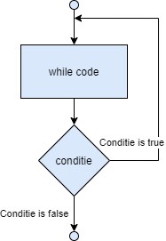

## While

De syntax van een while loop is eenvoudig:

```csharp
while (booleaanse expressie) 
{
  // C# die zal uitgevoegd worden zolang de booleaanse expressie waar is
}
```

Waarbij, net als bij een ``if`` statement, de conditie uitgedrukt wordt als een booleaanse expressie met 1 of meerdere relationele operatoren.

Zolang de conditie ``true`` is zal de code binnen de accolades uitgevoerd worden. Indien dus de conditie reeds vanaf het begin ``false`` is dan zal de code binnen de ``while``-loop niet worden uitgevoerd.

Telkens wanneer het programma aan het einde van het ``while`` codeblock komt springt het terug naar de conditie bovenaan en zal de test wederom uitvoeren. Is deze weer ``true`` dan wordt de code weer uitgevoerd. Van zodra de test ``false`` is zal de code voorbij het codeblock springen en na het ``while`` codeblok doorgaan.

Het diagramma is duidelijk:

 


Een voorbeeld van een eenvoudige while loop:

```csharp
int myCount = 0;
 
while (myCount < 100)
{
    myCount++;
    Console.WriteLine(myCount);
}
```

Zolang ``myCount`` kleiner is dan 100 (``myCount < 100``) zal myCount met 1 verhoogd worden en zal de huidige waarde van myCount getoond worden. We krijgen met dit programma dus alle getallen van 1 tot en met 100 op het scherm onder elkaar te zien.

Daar de test gebeurt aan het begin van de loop wil dit zeggen dat het getal 100 nog wel getoond zal worden. **Begrijp je waarom?** Test dit zelf!

## Do while

In tegenstelling tot een while loop, zal een do-while loop sowieso **minstens 1 keer uitgevoerd worden**. Ongeacht de opgegeven conditie zal de do-while loop zijn code 1 keer uitvoeren. We herhalen deze zin uitdrukkelijk 2x zodat het verschil tussen beide type loops duidelijk blijft.

Vergelijk volgende diagramma van de ``do while``:

 

 met die hierboven van de ``while``.

De syntax van een do-while is eveneens verraderlijk eenvoudig:

```csharp
do{
      // C# die uitgevoerd zal worden zolang de booleaanse expressie waar is
} while (booleaanse expressie);
```


Merk op dat achteraan de conditie een puntkomma na het ronde haakje staat. **Dit is een véél voorkomende fout. Bij een while is dit niet!**
Daar de test van een do-while achteraan de code van de loop gebeurt is het logisch dat een do-while dus minstens 1 keer wordt uitgevoerd. Het volgende eenvoudige aftelprogramma toont de werking van de do-while loop.


```csharp
int i = 10;
do
{
    i--;
    Console.WriteLine(i);
} while (i > 0);
```

Begrijp je wat dit programma zal doen?

## Complexe condities

Uiteraard mag de conditie waaraan een loop moet voldoen complexer zijn door middel van de  relationele operatoren.

Volgende ``while`` bijvoorbeeld zal uitgevoerd worden zolang ``teller`` groter is dan 5 en de variabele ``naam`` van het type ``string`` niet gelijk is aan "tim":

```csharp
while(teller > 5 && naam != "tim")
{
  //Keep repeating
}
```

## Oneindige loops
Indien de loop-conditie nooit ``false`` wordt dan heb je een oneindige loop gemaakt. Soms is dit gewenst gedrag (bijvoorbeeld bij de gameloop) soms is dit een bug en zal je dit moeten debuggen.

Volgende twee voorbeelden tonen dit:
* Een bewust oneindige loop:
```csharp
while(true)
{
 //See you in infinity
}
```
* Een bug die een oneindige loop veroorzaakt:
```csharp
int teller = 0; 
while(teller<10)
{
  Console.WriteLine(teller);
  teller--;    //oops, dit had teller++ moeten zijn
}
```


Probeer er altijd zeker van te zijn dat de variabele(n) die je gebruikt in je test-conditie ook in de loop aangepast worden. Als deze in de loop constant blijft dan zal ook de test-conditie dezelfde blijven en heb je dus een oneindige loop gemaakt.


## Scope van variabelen in loops
Let er op dat de scope van variabelen bij loops zeer belangrijk is. Indien je een variabele binnen de loop definieert dan zal deze steeds terug "gereset" worden wanneer de volgende cyclus van de loop start.
Volgende code toont bijvoorbeeld **foutief** hoe je de som van de eerste 10 getallen (1+2+3+...+10) zou maken:

```csharp
int teller= 1;
while(teller <= 10)
{
   int som= 0;
   som= som+teller;
   teller++;
}
Console.WriteLine(som); //deze lijn zal fout genereren
```

De **correcte** manier om dit op te lossen is te beseffen dat de variabele som enkel binnen de accolades van de while-loop gekend is. Op de koop toe wordt deze steeds terug op 0 gezet en er kan dus geen som van alle teller-waarden bijgehouden worden:
```csharp
int teller= 1;
int som=0;  
while(teller <= 10)
{
   
   som= som+teller;
   teller++
}
Console.WriteLine(som); 
```

## Foute input van gebruiker met loops verwerken
Dankzij loops kunnen we nu ook eenvoudiger omgaan met foutieve input van de gebruiker. Stel dat we volgende vraag hebben:

```csharp
Console.WriteLine("Geef uw keuze in: a, b of c");
string input= Console.ReadLine();
```

Met een loop kunnen we nu deze vragen blijven stellen tot de gebruiker een geldige input geeft:
```csharp
string input;
do
{
  Console.WriteLine("Geef uw keuze in: a, b of c");
  input= Console.ReadLine();
}while(input != "a"  || input != "b" || input != "c");
```
**Zolang (while) de gebruiker niet ``"a"`` OF ``"b"`` OF ``"c"`` invoert zal de loop zichzelf blijven herhalen.**

Merk op dat we de variabele ``string input`` VOOR de `` do while`` moeten aanmaken. Zouden we die IN de loop pas aanmaken dan zou de variabele niet als test kunnen gebruikt worden aan het einde van de loop.


Je ziet dat het stuk ``} while(input...);`` achteraan buiten de accolades van de loop ligt en dus een andere scope heeft.



# Kennisclip


* [De while loop en soorten loops](https://ap.cloud.panopto.eu/Panopto/Pages/Viewer.aspx?id=3d1f021e-0152-4dcd-9e73-a99800b53707)
* [Do-while loops](https://ap.cloud.panopto.eu/Panopto/Pages/Viewer.aspx?id=82314092-f4bf-408b-bb3f-a99800b6f1c8)
