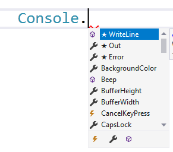

## Bestaande methoden en bibliotheken

Je herkent een methode aan de ronde haakjes na de methodenaam. Je hebt dus reeds een aantal methoden gebruikt zonder dat je het wist, denk maar aan ``WriteLine()``, ``ReadLine()`` en ``Convert.ToInt32()``.

Dit zijn dus alle 3 methoden: stukken code die een specifieke taak uitvoeren.

Sommige methoden, zoals ``WriteLine()``, vereisen dat je een aantal parameters meegeeft. De parameters dien je tussen de ronde haakjes te zetten. Hierbij is het uiterst belangrijk dat je de volgorde respecteert die de ontwikkelaar van de methode heeft gebruikt. Indien je niet weet wat deze volgorde is kan je altijd Intellisense gebruiken. Typ gewoon de methode in je code en stop met typen na het eerste ronde haakje, vervolgens verschijnen alle mogelijke manieren waarop je deze methoden kan oproepen (met de pijltjes kan je alle mogelijke manieren bekijken)


We zien telkens duidelijke de methode-signatuur: het return type (in dit geval ``void`` gevolgd door de naam van de methode en dan de parameters en hun datatype(s). Zoals al herhaardelijk aangehaald: de naam van de parameters doet er niet toe! Merk trouwens op dat je de WriteLine-methode ook mag aanroepen zonder parameters, dit zal resulteren in een lege lijn in de console.

Met behulp van de F1-toets kunnen meer info over de methode in kwestie tonen. Hiervoor dien je je cursor op de Methode in je code te plaatsen, en vervolgens op F1 te drukken.

Voor ``WriteLine`` geeft dit:


In de *overload list* zien we de verschillende manieren waarop je de methode in kwestie kan aanroepen. Je kan op iedere methode klikken voor meer informatie en een codevoorbeeld.



### Intellisense
"Hoe kan je deze methode nu gebruiken?" is een veelgestelde vraag. Zeker wanneer je de basis van C# onder knie hebt en je stilletjes aan met bestaande .NET bibliotheken wil gaan werken. Wat volgt is een essentieel onderdeel van VS dat veel gevloek en tandengeknars zal voorkomen.

De help-files van VS zijn zeer uitgebreid en dankzij IntelliSense krijg je ook aardig wat informatie tijdens het typen van de code zelf.

Type daarom onder vorige WriteLine-zin het volgende:

```csharp
System.Console.
```

Wacht nu even en er zal na het punt (``.``) een lijst komen van methoden en fields die beschikbaar zijn. Je kan hier met de muis doorheen scrollen en zo zien welke methoden allemaal bij de Console klasse horen.



Dit geldt idem voor andere bestaande bibliotheken. Nu snappen we ook eindelijk wat al die informatie bij ``Math.Pow`` wil zeggen:



