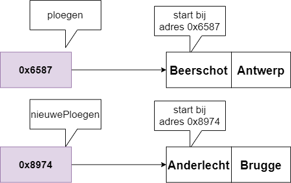

## Geheugengebruik bij arrays

Met arrays komen we voor het eerst iets dichter tot één van de sterkstes van C#, namelijk het aspect **referenties**. In het volgende boekdeel zullen we hier ongelooflijk veel mee doen, maar laten we nu alvast eens kijken waarom arrays met referenties werken.

### Reference types en value types

In C# heb je twee soorten variabelen die we nu kort toelichten maar in het volgende deel verder zullen uitdiepen:

* **Value** types: deze variabelen bevatten effectief de waarde die de variabele moet hebben. Als we schrijven ``int age = 5`` dan bewaren we de binaire voorstelling voor het geheel getal ``5`` in het geheugen. 
* **Reference** types: deze variabelen bewaren een geheugenadres naar een andere plek in het geheugen waar de effectieve waarde(n) van de variabele te vinden is. Reference types zijn als het ware een wegwijzer en worden ook soms *pointers* genoemd.


Alle datatypes die we tot nog toe zagen (``string`` is een speciaal geval en negeren we om nachtmerries te vermijden) werken steevast *by value*. Momenteel zijn het enkel arrays die we kennen die *by reference* werken in C#. In het volgende deel zullen we zien dat er echter nog een hele hoop andere mysterieuze dingen (genaamd *objecten*) zijn die ook *by reference* werken.


<!---{pagebreak} --->

### Arrays kopiëren

#### Het probleem als je arrays wilt kopiëren
Arrays worden 'by reference' gebruikt in C#. Dit wil zeggen dat als we schrijven:
```java
int[] getallen = {5,42,2};
```

we in ``getallen`` enkel een geheugenadres bewaren dat wijst naar de plek waar de effectieve waarden staan elders in het geheugen. Dit in tegenstelling tot wanneer we ``int age = 5`` schrijven. (de redenen hiervoor zien we in het volgende deel). Volgende afbeelding geeft dit weer:

<!--- {width:80%} --->


Het gevolg van voorgaande is dat volgende code niet zal doen wat je vermoedelijk wenst:

```java
string[] ploegen = {"Beerschot", "Antwerp"};
string[] nieuwePloegen = {"Anderlecht", "Brugge"};
nieuwePloegen = ploegen;
```

<!---{pagebreak} --->

De situatie wanneer lijn 2 werd uitgevoerd is de volgende:
<!--- {width:60%} --->


Zonder het bestaan van *references* zou je verwachten dat op lijn 3 ``nieuwePloegen`` een kopie krijgt van de inhoud van ``ploegen``. 

De derde lijn(``nieuwePloegen = ploegen;``) zal perfect werken. Wat er echter is gebeurd, is dat we de referentie naar ``ploegen`` ook in ``nieuwePloegen`` hebben geplaatst. **Bijgevolg verwijzen beide variabelen naar dezelfde array, namelijk die waar ``ploegen`` al naar verwees.** We hebben een soort alias gemaakt en kunnen nu op twee manieren de array met de Antwerpse voetbalploegen benaderen. De nieuwe situatie na lijn 3 is dus de volgende geworden:

<!--- {width:60%} --->


<!---{pagebreak} --->

Als je vervolgens schrijft:

```java
nieuwePloegen[1] = "Beerschot";
```

Dan is dat hetzelfde als onderstaande schrijven daar beide variabele naar dezelfde array-inhoud verwijzen. Het effect zal dus hetzelfde zijn.

```java
ploegen[1] = "Beerschot";
```

En waar staan de ploegen in de nieuwePloegen array (``"Anderlecht"`` en ``"Brugge"``)? **Die array in het geheugen is niet meer bereikbaar** (de garbage collector zal deze ten gepaste verwijderen, wat in het volgende boekdeel zal toegelicht worden).

#### De oplossing als je arrays wilt kopiëren

Wil je dus arrays kopiëren dan kan dat niet op deze manier: **je moet manueel ieder element van de ene naar de andere array kopiëren** als volgt:

```java
for(int i = 0; i < ploegen.Length; i++)
{
    nieuwePloegen[i] = ploegen[i];
}
```


Er is een ingebouwde methode in de ``Array``-bibliotheek (deze bibliotheek zien we in de volgende sectie) die ook toelaat om arrays te kopiëren genaamd ``Copy``. 



Opgelet: wanneer je met arrays van objecten (zie het tweede boekdeel) werkt dan zal bovenstaande mogelijk niet het gewenste resultaat geven daar we nu ook de individuele referenties van een object kopiëren!


<!---NOBOOKSTART--->
## Kennisclip

* [Arrays en geheugen](https://ap.cloud.panopto.eu/Panopto/Pages/Viewer.aspx?id=1a57ab27-bb21-4bd8-8b37-ac4f00d3cf97)

<!---NOBOOKEND--->
