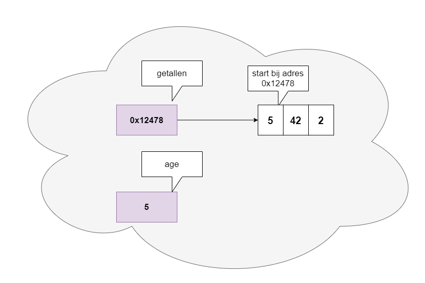
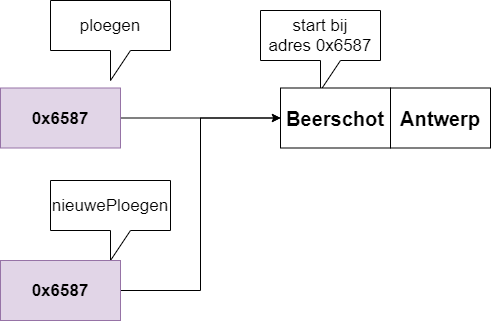

## Geheugengebruik bij arrays

Met arrays komen we voor het eerst iets dichter tot een van de sterkstes van C#, namelijk het aspect **referenties**. In het tweede van dit boek zullen we hier ongelooflijk veel mee doen, maar laten we nu alvast eens kijken waarom arrays met referenties werken.

### Reference types en value types

In C# heb je twee soorten variabelen die we nu kort toelichten maar in het volgende deel verder zullen uitdiepen:

* **Value** types: deze variabelen bevatten effectief de waarde die de variabele moet hebben. Als we schrijven ``int age = 5`` dan bewaren we de binaire voorstelling voor ``5`` in het geheugen.
* **Reference** types: deze variabelen bewaren een geheugenadres naar een andere plek in het geheugen waar de effectieve waarde(n) van de variabele te vinden is. Reference types zijn als het ware een wegwijzer.

### Arrays kopiëren

Arrays worden 'by reference' gebruikt in C#. Dit wil zeggen dat als we schrijven:
```csharp
int[] getallen = {5,42,2};
```

We in ``getallen`` enkel een geheugenadres bewaren dat wijst naar de plek waar de effectieve waarden staan. Dit in tegenstelling tot wanneer we ``int age = 5`` schrijven.




Het gevolg van voorgaande is dat volgende code niet zal doen wat je vermoedelijk wenst:

```csharp
string[] ploegen= {"Beerschot", "Antwerp"};
string[] nieuwePloegen = {"Anderlecht", "Brugge"};
nieuwePloegen = ploegen;
```

De situatie wanneer lijn 2 werd uitgevoerd is de volgende:
<!--- {height:80%} --->


Deze code (``nieuwePloegen = ploegen;``) zal perfect werken. Wat er er echter is gebeurd is dat we de referentie naar ``ploegen`` ook in ``nieuwePloegen`` hebben geplaatst. Bijgevolg verwijzen beide variabelen naar dezelfde array, namelijk die waar ``ploegen`` al naar verwees. We hebben een soort alias gemaakt en kunnen nu op twee manieren de array benaderen.

<!--- {height:80%} --->


Als je dus  schrijft:

```csharp
nieuwePloegen[1] = "Beerschot";
```

Dan is dat hetzelfde als schrijven:

```csharp
ploegen[1] = "Beerschot";
```

En waar staan de ploegen in de nieuwePloegen array? **Die bestaat niet meer!**

Wil je dus arrays kopieren dan kan dat niet op deze manier: **je moet manueel ieder element van de ene naar de andere array kopiëren** als volgt:
```csharp
for(int i = 0; i < ploegen.Length; i++)
{
    nieuwePloegen[i] = ploegen[i];
}
```


Er is een ingebouwde methode in de ``Array``-bibliotheek (deze bibliotheek zien we in de volgende sectie) die ook toelaat om arrays te kopieren genaamd ``Copy``. 




**Opgelet: wanneer je met arrays van objecten ([zie het tweede deel van dit boek](../11_arraysvanklassen/7_arraysvanobj.md)) werkt dan zal bovenstaande mogelijk niet het gewenste resultaten geven daar we nu ook de individuele referenties van een object kopieren!**
