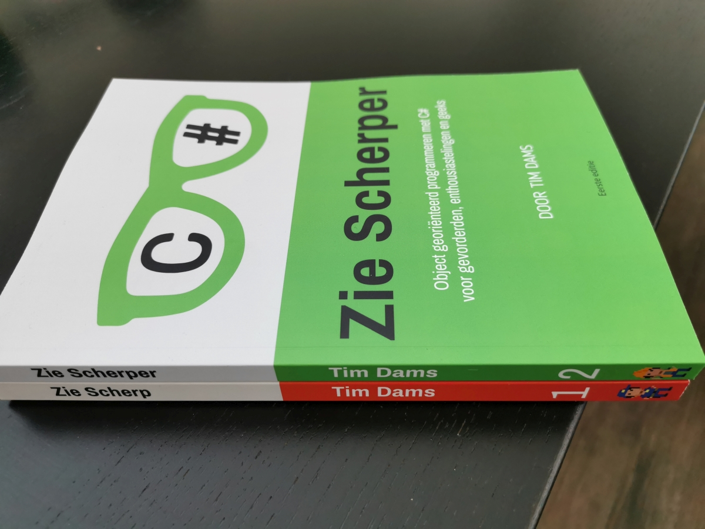

# See sharp
# About this book

This book is used as handbook within the proffesional bachelor Electronics-ICT and Applied Informatics at AP University College.

Specifically, this is the handbook used for the first 2 semesters concerning 'learning to program with C\#':

* See Sharp: Programming Principles, first semester
* See Sharper: Object Oriented Programming, second semester

# Acquiring the book

This course is also offered to the "outside world". This online course will at all times be available under the Creative Commons 4.0 principle (see below). Do you want this course in paper or other digital form anyways? This is possible through [ziescherp.be](ziescherp.be) (Dutch).


The follow-up book (See Sharper) is also available. See [ziescherp.be](ziescherp.be) for more information.

There is also een edition (See Sharp Sharper) that combines both books in one handy whole. For this I'd like to also refer to [ziescherp.be](ziescherp.be).


# Licensed under Creative Commmons Attribution-NonCommercial 4.0 International \(CC BY-NC 4.0\)

Licensed under CC-BY-NC 4.0 as shown [here](LICENSE.MD).

This is a human-readable summary of \(and not a substitute for\) the [license](LICENSE.MD).

## You are free to

**Share** : copy and redistribute the material in any medium or format

**Adapt** : remix, transform, and build upon the material

The licensor cannot revoke these freedoms as long as you follow the license terms.

## Under the following terms

**Attribution** : You must give appropriate credit, provide a link to the license, and indicate if changes were made. You may do so in any reasonable manner, but not in any way that suggests the licensor endorses you or your use.  
**NonCommercial** : You may not use the material for commercial purposes.

**No additional restrictions** : You may not apply legal terms or technological measures that legally restrict others from doing anything the license permits.
